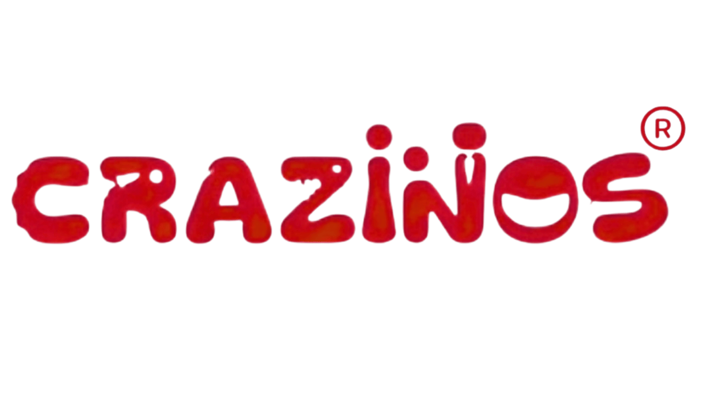

# 🏗️ CRAZiNOS - Stack Tower

A fun and dynamic physics-based tower stacking game built with **Vite**, **Matter.js**, and **HTML5 Canvas**. Test your precision and timing by dropping blocks from a swinging crane to build the tallest tower possible!



## ✨ Features

- **🎮 Physics-Based Gameplay:** Powered by `Matter.js` for realistic stacking, swaying, and balance mechanics.
- **🔬 Educational Physics Visualizations:** Exposes the real-time math and mechanics behind gameplay:
  - 📐 **Oscillation Angle Arc (Pendulum Physics):** Displays a dynamic, color-coded arc (Green: 0°-15°, Yellow: 16°-30°, Red: >30°) at the crane's top pivot showing real-time swing angles and potential energy.
  - ⚡ **Free Fall Velocity Meter (Kinematics):** A glowing vertical power gauge tracking downward velocity in real-time upon block release, transitioning from cool Cyan to hot Red as kinetic energy builds before impact.
- **🌅 Dynamic Day/Night Cycle:** The background sky transitions smoothly from morning to noon, evening, and night as your tower grows taller.
- **🛒 In-Game Shop & Customization:** Earn gold coins by stacking blocks and spend them in the shop to unlock:
  - 🏗️ **Cranes:** Yellow, Red, Industrial, Cyber, Gold, and Neon cranes.
  - 🧱 **Blocks:** Concrete, Brick, Glass, Gold, Neon, and Holographic blocks.
  - 🟫 **Bases:** Standard Concrete, Neon Grid, Dream Cloud, and Ancient Ruins.
  - 🌌 **Decorations:** Plain Sky, City Skyline, Starry Night, and Fireworks.
- **🔥 Combo System:** Stack blocks cleanly with high stability to build up your multiplier and increase difficulty!
- **📸 Screenshot & Sharing:** Easily capture and download high-resolution gameplay watermarked screenshots of your towering achievements with custom affirmations and score banners.
- **⚙️ Customizable Settings:** Full control over audio (Master, Music, SFX), visual brightness/contrast, and accessibility toggles (Screen Shake).

## 🛠️ Tech Stack

- **Core:** Vanilla JavaScript (ES6+ Modules), HTML5 Canvas
- **Physics Engine:** [Matter.js](https://brm.io/matter-js/)
- **Build Tool / Bundler:** [Vite](https://vitejs.dev/)
- **Styling:** Custom responsive Vanilla CSS

## 🚀 Getting Started

Follow these instructions to get a copy of the project up and running on your local machine for development and testing.

### Prerequisites

Ensure you have [Node.js](https://nodejs.org/) installed on your computer.

### Installation

1. **Clone the repository:**
   ```bash
   git clone https://github.com/Stutyay/stack-tower.git
   cd stack-tower
   ```

2. **Install dependencies:**
   ```bash
   npm install
   ```

3. **Start the local development server:**
   ```bash
   npm run dev
   ```

4. **Open your browser:**
   Navigate to `http://localhost:5173/` (or the URL shown in your terminal) to play the game!

## 🎮 How to Play

1. Click or tap anywhere on the screen (or press the **Spacebar**) to release the swinging block from the crane.
2. Align the block carefully with the top of your tower—off-center drops will cause your tower to sway and eventually collapse!
3. Each successfully stacked block earns you **1 Gold Coin** and adds to your tower's total height.
4. If your tower collapses, visit the **Shop** from the main menu to spend your earned coins on cool new skins and themes!

## 📝 License

This project is part of the **Crazy XYZ Games** collection.
